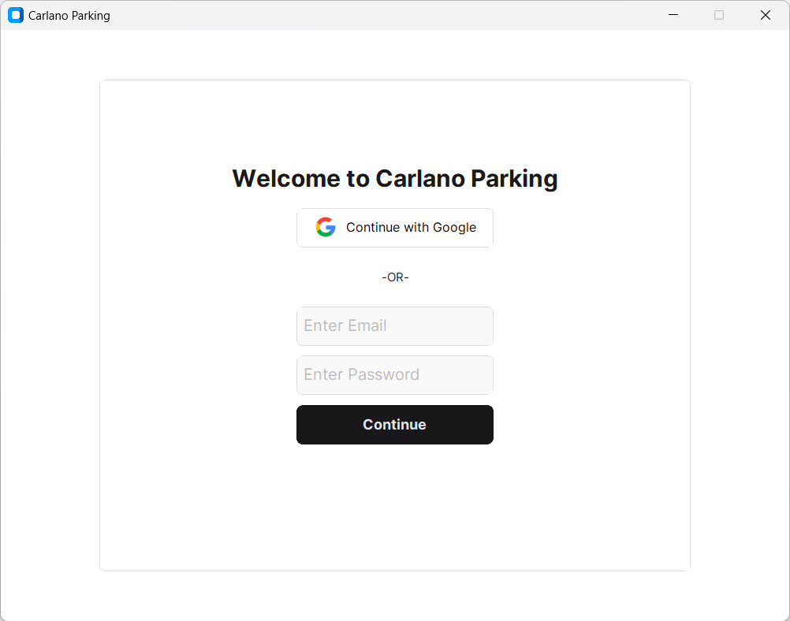
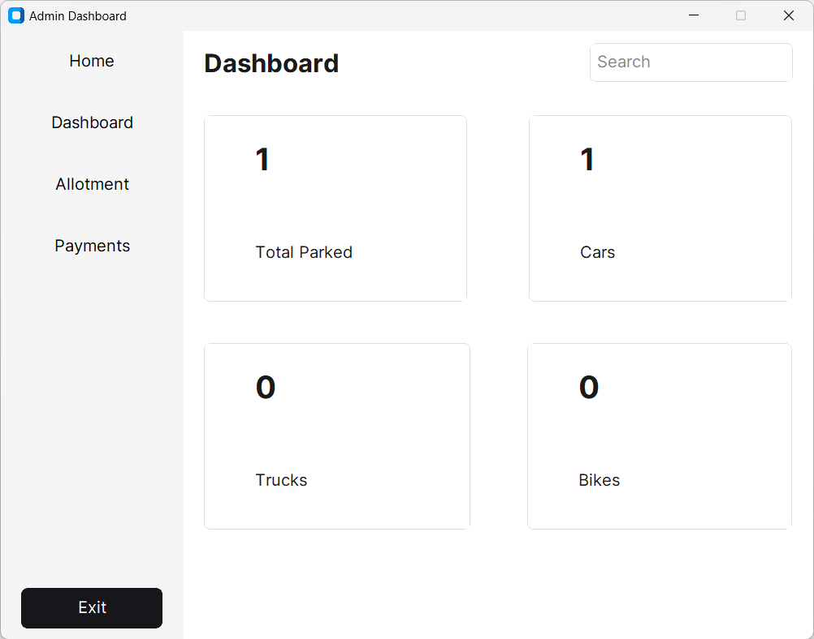

# Carlano Parking System

# Intro
👋 Hello there! 

Welcome to the Carlano Parking System. This is a system designed to help manage parking spaces in our building. 

...
#
The system is used by the admins at that place(usually gate guards) where they log data of every vehicle that has entered or left the parking space.

As for this project, I've already put some admins in the database. They can log in using those emails. They can also log in using Google auth.

After successful login, a dashboard appears as below:

## Sidebar

* __Dashboard__ - shows total number of cars parked, number of specific type of vehicles parked as well

* __Allotment__ - this is where the management of car parking is done

* __Payments__ - where payments are done (for example penalties)

## Technologies used

* __Python__
* __Customtkinter__
* __Google auth__
* __SQLite DB__
* __Bcrypt__
* __SQLAlchemy__
* __Paynow__
* __regex__